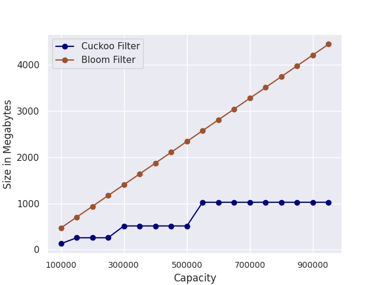

:::info
Disclaimer: This is not a general comparison between Bloom filters and Cuckoo filters.  
This blog post summarizes some of the experiments we conducted to decide whether or not we should replace our implementation of Counting Bloom filters with Cuckoo filters, for a specific use case.
:::

## Background
Nodes on Fleek Network currently use Counting Bloom filters to summarize their cached content. These cache summaries are exchanged with other nodes in order to facilitate content routing.
If a particular node does not store a requested piece of content, it can use the Bloom filters that it received from its peers to check if a peer stores the requested content. 
We are using Counting Bloom filters rather than regular Bloom filters because we need to be able to remove elements from the filter to support cache eviction.

## Bloom Filters
A Bloom filter is a space-efficient probabilistic data structure that can be used to perform approximate set membership queries.
The answer to an approximate set membership query is not `no` or `yes,` but rather `no` or `probably.` This `probably` is quantified with the false positive rate.  
One of the convenient features of Bloom filters is that they can be configured to have a specific false positive rate.
Of course, there is a tradeoff here; the lower the false positive rate, the larger the memory footprint. Bloom filters support two operations: `insert` and `contains.`  
A Bloom filter is represented by an array of $m$ bits together with $k$ independent hash functions. To insert an element into the filter, it is hashed with each of the $k$ hash functions.
The resulting hashes are interpreted as integers (modulo $m$) to obtain $k$ array positions. The bits at these positions are then set to 1 (if there aren't already 1).  
To check whether or not an element is contained in the filter, the element is hashed $k$ times with the different hash functions.
If all bits at the resulting array positions are 1, the element is assumed to be present. If any of the $k$ bits are zero, we can be certain that the queried element is not present in the set.
However, even if all bits are 1, it might still be the case that the bits were set by a combination of other elements. This is where the aforementioned false positive rate comes into play.  
Since we also need a `remove` operation for our use case, we have been using Counting Bloom filters, a variant of Bloom filters.
Counting Bloom filters retain most of the properties that regular Bloom filters have. The `remove` operation comes at the cost of an increased memory footprint.
Each position in the array is no longer a single bit but a group of bits representing a counter.
Whenever an element is inserted into the filter, the counters for all $k$ positions are incremented by 1. To remove an element, we decrement the counters.

## Cuckoo Filters
Bloom filters are the most known members of a class of data structures called Approximate Membership Query Filters (AMQ Filters).
A relatively recent addition to this class is the Cuckoo filter [1]. Cuckoo filters share many similarities with Bloom filters, especially Counting Bloom filters.
They are space-efficient and can be used for approximate set membership queries. Cuckoo filters also support the operations `insert,` `contains,` and `remove,` and have configurable false positive rates.  
Cuckoo filters are based on Cuckoo hash tables [2] and leverage an optimization called _partial-key cuckoo hashing_. A basic Cuckoo hash table consists of an array of buckets.
We determine two candidate buckets for each element using two different hash functions, $h_1$ and $h_2$.  
The `contains` operation will check if either bucket contains the element.
For insertion, if either bucket is empty, the element will be inserted into the empty bucket.
If neither bucket is empty, one of the buckets is selected, and the existing element is removed and inserted into its alternate location.
This may trigger another relocation if the alternate location is not empty.  
Although the insertion operation may perform a sequence of relocations, the amortized runtime is $O(1)$.  
Most implementations of Cuckoo hash tables and, consequently, Cuckoo filters will use buckets that can hold multiple elements, as proposed in [3].
For Cuckoo filters, the hash table size is reduced by only storing fingerprints - a bit string calculated from an element's hash - rather than key-value pairs.
The fingerprint size is derived from the desired false positive rate.  
A problem that arises is that, to relocate existing fingerprints using the Cuckoo hashing approach described above, we need the original hash from which the fingerprint was derived.
Of course, we could store this hash somewhere, but the whole point of using fingerprints is to reduce the memory footprint of the filter.
The solution to this predicament is the aforementioned _partial-key cuckoo hashing_, a technique for determining an element's alternate location using only its fingerprint.  
For a given element $x$, the two candidate buckets are computed as follows:  

$h_1(x) = \text{hash}(x)$ 
$h_2(x) = h_1(x) \oplus \text{hash}(\text{fingerprint}(x))$  

An important property of this technique is that $h_1(x)$ can also be computed from $h_2(x)$ and the fingerprint.

## Benchmarking
As this post mentioned, we are not aiming for a general comparison of Counting Bloom and Cuckoo filters.
Instead, we want to determine which filter suits our specific use case better. The two main properties we are looking for are space efficiency and lookup performance.  
Space efficiency is important because nodes frequently update their cache and have to communicate these changes with their peers. These messages should take up as little bandwidth as possible.
Lookup speed is also important because Fleek Network aims to serve user requests as quickly as possible. Checking whether a peer has some content stored in their cache summary should not be a bottleneck.  

## Experimental Setup
We are using our own Counting Bloom filter [implementation](https://github.com/fleek-network/ursa/blob/483f4d56cbaa5e83182454d2c1db6f6af7c54912/crates/ursa-network/src/utils/bloom_filter.rs#L11) and 
[this](https://github.com/sile/scalable_cuckoo_filter) Cuckoo filter implementation in Rust (the [original](https://github.com/efficient/cuckoofilter) implementation is in C++). All experiments
were performed on a Linux machine with 16 GB RAM and an Intel Core i7 (10th Gen). Whenever the experiment is probabilistic, we repeat the experiment 20 times and report the mean and standard deviation.

## Memory Footprint
For both Counting Bloom filters and Cuckoo filters, the memory footprint is determined by two factors: the filter's capacity and the desired false positive rate. In the first experiment, we examine the impact that
these factors have on the memory footprint.  
To this end, we fix the false positive rate and initialize the filters with capacities ranging from 100K to 1M. The result is shown in Fig. 1. The size of Bloom filters
scales linearly with the capacity. Cuckoo filters are more space-efficient. This result is consistent with the experiments reported in [1].

</img>

<i>Figure 1: We fix the false positive rate and initialize the filters with capacities ranging from 100K to 1M. The y-axis shows the size of the filters in Megabytes.</i>

Next, we fix the capacity and initialize the filters with false positive rates ranging from 0.0001 to 0.5. Fig. 2 shows that Cuckoo filters are more space-efficient.
The gap between Counting Bloom filters and Cuckoo filters grows as the false positive rate decreases. This is also consistent with experiments in [1].

</img>

<i>Figure 2: We fix the capacity and initialize the filters with false positive rates ranging from 0.0001 to 0.5. The y-axis shows the size of the filters in Megabytes.</i>

## Lookup Performance
We first add elements to both filters until the capacity is reached. We then measure the lookup performance for different ratios of positive and negative lookups.
A positive lookup is for an existing element, and a negative lookup is for an element not contained in the filter. We perform 100K lookups for each ratio and report
the average lookup duration and standard deviation. Fig. 3 shows the results. Bloom filters perform slightly better on average than Cuckoo filters. This result is inconsistent with [1],
where Cuckoo filters were reported to have a better lookup performance than Bloom filters. It should be noted here that the authors in [1] use the original C++ Cuckoo filter implementation and their
own unreleased Bloom filter implementation. In contrast, we use a Rust Cuckoo filter implementation and our Bloom filter implementation. We cannot easily determine the reason for this discrepancy.
However, the performance difference is negligible.

</img>

<i>Figure 3: Lookup performance for different ratios of positive and negative lookups. For example, ratio 0.25 indicates that 25% of lookups are positive and 75% are negative.
The shaded region indicates the standard deviation.</i>

## Insertion Performance
Less critical than lookup performance but still important for our purposes is insertion performance. We measure how the insertion performance varies for different occupancy levels.
Fig. 4 shows the results. The insertion performance is constant across all levels of occupancy
for Bloom filters. For Cuckoo filters, the performance decreases as the filter becomes fuller because more relocations are required. In Fig. 4, the performance for Bloom filters is not constant. It quickly increases and then remains constant. This can be explained by CPU caching. 

</img>

<i>Figure 4: Insertion performance for different occupancy levels. The shaded region indicates the standard deviation.</i>

## Capacity and Scaling
We have mentioned the capacity of a filter several times now. An interesting case is what happens when a filter's capacity is exceeded.
Bloom filters and Cuckoo filters behave differently in this scenario. For Bloom filters, the `insertion` operation always succeeds. However, the false positive rate
will rapidly increase as we exceed the filter's capacity. While Bloom filters fail silently, Cuckoo filters are more explicit. Most implementations have a maximum number of
relocations that will be performed for an insertion. The `insertion` operation will return an error if more relocations are required.  
For both filters, we can avoid this problem by simply initializing the filter with a sufficiently large capacity. However, this will increase the memory footprint of the filter.
Furthermore, it is difficult to predict how many elements a node on Fleek Network will cache. It is also likely that the number of cached elements will greatly vary for different nodes.  
Fortunately, a variant of Bloom filters called _Scalable Bloom Filters_ [4] can adapt dynamically to the number of elements stored while guaranteeing a maximum false positive rate.
The proposed technique is also applicable to Cuckoo filters.

## Other Filters
While we only looked at Bloom filters and Cuckoo filters, there are other AMQ filters that we want to mention here briefly:
* Quotient filters [5, 6]: Compact hash tables that support insertion, lookup, and deletion. Less space-efficient than Bloom filters and Cuckoo filters.  
* XOR filters [7]: More space-efficient than Bloom filters and Cuckoo filters. However, they are static, meaning the filter has to be rebuilt if additional elements are added. 

## Conclusion
We examined whether Counting Bloom filters or Cuckoo filters are more suitable for summarizing caches on Fleek Network. Cuckoo filters are more space-efficient, especially
for lower false positive rates. Bloom filters have a slightly better insertion and lookup performance for the implementations we tested.
Both filters can be adapted to grow and shrink in size dynamically. Since the difference in insertion and lookup performance is negligible while Cuckoo filters
are significantly more space-efficient, we favor Cuckoo filters for our use case.  

### References
[1] Bin Fan, Dave G. Andersen, Michael Kaminsky, and Michael D. Mitzenmacher. Cuckoo Filter: Practically Better Than Bloom.
In Proceedings of the 10th ACM International Conference on emerging Networking Experiments and Technologies (CoNEXT 14). Association for Computing Machinery, New York, NY, USA, pp. 75-88, 2014.  
[2] Rasmus Pagha and Flemming Friche Rodler. Cuckoo hashing. Journal of Algorithms, 51(2), pp. 122-144, 2004.  
[3] Martin Dietzfelbinger and Christoph Weidling. Balanced Allocation and Dictionaries with Tightly Packed Constant Size Bins. Theoretical Computer Science, 380(1), pp. 47-68, 2007.  
[4] Paulo S. Almeida, Carlos Baquero, Nuno Preguiça, and David Hutchison. Scalable Bloom Filters. Information Processing Letters, 101(6), pp. 255-261, 2007.  
[5] John G. Cleary. Compact hash tables using bidirectional linear probing. IEEE Transactions on Computers. 33(9), pp. 828-834, 1984.  
[6] Anna Pagh, Rasmus Pagh, and S. Srinivasa Rao. An optimal Bloom filter replacement. Proceedings of the Sixteenth Annual ACM-SIAM Symposium on Discrete Algorithms, pp. 823-829, 2005.  
[7] Thomas Mueller Graf and Daniel Lemire. Xor Filters: Faster and Smaller Than Bloom and Cuckoo Filters. ACM Journal of Experimental Algorithmics. 25, pp. 1-16, 2020.  
