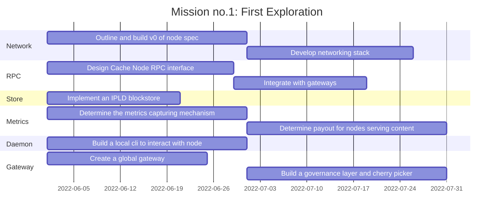

## Introduction

Fleek Network is a decentralized content and application layer built on established decentralized storage protocols combined with high-speed caching and an effective delivery layer. An alternative to traditional content delivery networks without a central authority that is reliable and censorship-resistant. Fleek Network relies on blockchain technology at its core, allowing governance 
and token rewards as incentives for participation in serving the network.

<!--truncate-->

💡 This content was originally posted in [hackmd.io](https://hackmd.io/5jExeM1yQ7Sm_ly-6cp0ng)

## Motivation

Storage based traffic makes up 80% of Fleek traffic, the other 20% is for our websites.


> Globally, gaming traffic will be 6% of consumer Internet traffic in 2021, up from 2% in 2016...
>
> [Cisco Research](https://www.cisco.com/c/dam/m/en_us/solutions/service-provider/vni-forecast-highlights/pdf/Global_2021_Forecast_Highlights.pdf)

> Globally, consumer Internet video traffic will be 81% of consumer Internet traffic in 2021, up from 72% in 2016.
>
> [Cisco Research](https://www.cisco.com/c/dam/m/en_us/solutions/service-provider/vni-forecast-highlights/pdf/Global_2021_Forecast_Highlights.pdf)

## Whats next for Fleek?

Decentralize our entire stack! Today we start with an important piece in our stack, the CDN.

- Accelerate IPFS content retrieval
- Better UX for storage and hosting
- Become non-custodial

---

## Fleek Network

- Decentralized
- Scale with demand
- Web3 content
- Interoperable
- Robustness
- P2P

## Architecture

- Content Routing
- GossipSub
- DHT
- Peer discovery
- DHT (Kademlia)
- Request/Response
- Bitswap/Graphsync
- Gateway 


## P2P


- Libp2p based
- Trustless
- Censorship-resistant
- Resilient
- Gossiping Protocol
- Content addressable

---

## Content Routing

- DHT based content routing
- Gossip based routing
    - Bitswap
    - Graphsync Req/Res
- Not permanent
    - Cache eviction

## Peer Discovery

- DHT (Kademlia)
- mDns
- Pruning and Grafting, passing lists of peers 
- Relay Nodes for nodes behind firewalls
- Fleek Bootstrap nodes
- Act as the network orchestrators
- Gossip Only
- Peer exchange through our Fleek bootstrap nodes

## Consensus


- Narwhal and Bullshark
    - Data availability is ensured using Narwhal
    - Bullshark over Tusk for ordering

**Comparing Tusk vs Bullshark:**

|          | Common round latency | Async round latency | Garbage collection | Fairness |
| -------- | -------- | -------- | -------- | -------- |
| Tusk     | 3     | E(7)     |  yes  | no |
| Bullshark     | 2     | E(6)     | yes    | during sync |


Click [here](../docs/whitepaper) to find more information about the Fleek Network consensus.

> Decoupling data dissemination from metadata ordering is the key mechanism to allow scalable and high throughput consensus systems 
> 
> [Narwhal & Tusk](https://arxiv.org/pdf/2105.11827.pdf)


## Indexer


- Each cache node runs an index provider
- Index provider announces the content availability to indexer
- Indexer get the nodes (for Bitswap/GraphSync) that are holding the content
- Accelerates content routing and discovery

## Gateway
- Cherry Picker
- Minimizes latency of requests
- Governance
    - Bootstrapping 
    - Ledger of nodes
- Nodes setup
    - TLS
    - DNS


## Security
- Sybil
- Eclipse
- Spam
- Bootstrap
- Sybil/Eclipse

User story
---

```gherkin=
Feature: Accelerate Content
  As an app
  I want to put content onto the Ursa CDN
  Because I want to accelerate my content worldwide
  Given a trustless, censorship resistent premise

  Scenario: App puts content to Ursa
    Given I'm a signed up to ursa and have an endpoint id
    When I use the given api
    And I make a put request with my content
    Then the content should be uploaded to the network
    And distributed amongst peers and cached on the network and gateway
    And the nodes will also cache the data locally until storage threshold
```

```gherkin=
Feature: Get Content
  As an app
  I want to get my content from Ursa CDN
  Because I want to serve it to my clients

  Scenario: App requests for `/:cid`
    Given the App has a valid endpoint url
    When the App makes a `Get` request for the `cid`
    Then the Gateway returns the data if it is cached
    But if not cached, it will query the closest node
    And if cache miss, gateways
    And nodes will cache the content for repeated requests
    
```

User flows
---

```sequence
Client->Gateway: Get: "/<client_endpoint>/:cid"

Gateway->Cherry Picker: Pick closest node

Cherry Picker->Node: Get content
Note right of Node: From cache or content routing

Node-->Client: Returns content and caches it

Note left of Client: Incrementally verifies the data
```


Project Timeline
---


## Appendix

:::info
**More coming soon!**
**This is a general overiew, paper, repo, and official announcement soon**
:::

